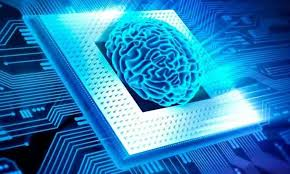
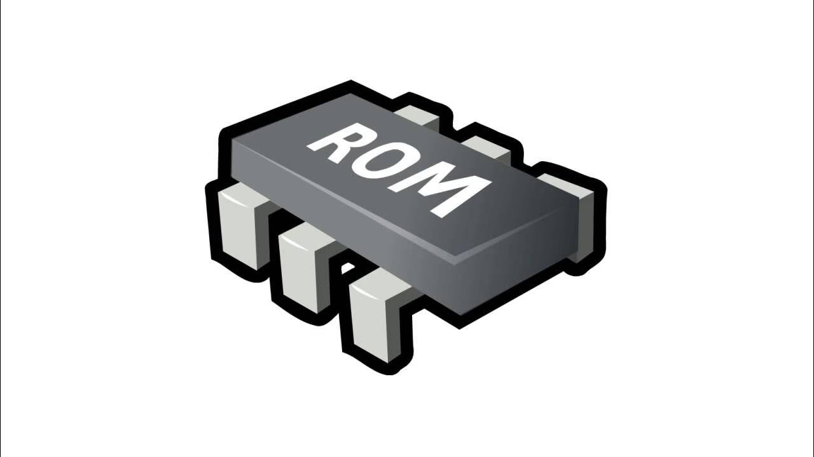

# INVESTIGACIÓN ACERCA DE LOS COMPONENTE DE UN PROCESADOR

## 1. CPU (Central Porcessing Unit)

Al hablar de la CPU se puede definir como el componente principal de todo ordenador ya que que es "el cerebro activo" del ordenador donde está formada por un conjunto de circuitos electrónicos que pueden ejecutar el OS (sistema operativo) ademas de ejecutar las aplicaciones que tiene el ordenador y otras operaciones informaticas. Puede realizar varias tareas y regula las funciones internas, supervisando el consumo de energía, etc... No solo se encuentran en el computador, tambien se encuentran en el smartphone, tableta o en cualquier dispositivo electrónico.

También la CPU ejecuta una secuencia de instrucciones y procesa los datos de las mismas, donde las instrucciones son las que realizan los programas para desarrollar aquella tarea que se le indica

## 2. ALU (Unidad Aritmético Lógica)

Se define como un circuito digital donde lo que hace es que calcula operaciones aritméticas y operaciones lógicas entre dos numeros.

Como por ejemplo la suma, resta, multiplicación, división, etc... y logicas como AND, OR, NOT, XOR sobre datos binarios. Donde a partir de estas operacines permite el funcionamiento de los programas y procesos del sistema.

## 3. Registros

Son pequeñas unidades donde se almacenan a alta velocidad ubicadas dentro de la CPU, donde guardan temporalmente datos e intrucciones que necesita la CPU, los registros se dividen en dos:
 1. Registros de Porposito General
 2. Registros Especificos

### Registros de proposito general

También conocidos como GPR son aquellos registros que pueden almacenar datos temporales, direcciones de memoria o resultados intermedios de operaciones. Estos pueden usarse de manera flexible 
según las necesidades que tenga el programa, sus principales características son un uso versatil, tienen alta velocidad y son de cantidad variable

### Registros Específicos

Este tipo de registros son diseñados para realizar funcioes concretas dentro de la CPU, estos tienen una función definida dentro del ciclo de ejecución de instrucciones 
podemos ver el ejemplo del contador del programa (Program Counter) que en este caso guarda la dirección de la proxima instruccion a ejecutar o tambien del puntero de silla (Stack Pointer) que se
encarga del apuntar al tope de la pila de memoria.

## 4. Unidad de Control 

Es ua de las partes fundamentales de un procesador debido a que se encarga de dirigir y coordinar la ejecución de instrucciones dentro de la CPU podemos enumerar las funciones de la unidad de control:

 1. Decodificación de instrucciones
 2. Generación de señales de control
 3. Gestión del flujo de instrucciones
 4. Coordinación con la ALU
 5. Gestión de la memoria y los registros 

## 5. Buses de datos y de dirección

Son canales de comunicación que permite la transferencia de información entre la CPU, la memoria y otros dispositivos del sistema. 

### Buses de datos

La función de este tipo de buses es que transporta los datos entre el procesador la memoria y los perifericos, donde puede leer y escribir datos en la memoria o en los dispositivos de entrada y de salida.

### Buses de dirección 

Su función principal es cuando el procesador necesita acceder a la memoria se usa para indicar en este caso la ubicación de la memoria.

### 6. Memoria RAM y Memoria ROM

Son dos tipos de memoria que se diferencian en sus características.
 
 1. Memoria RAM: Su función principal es que almacena datos e instrucciones temporalemente mientras el sistema está en funcionamiento.

 
 2. Memoria ROM: Su función es almacenar los datos de manera permanente para el arranque y funcionamiento del sistema.

 

fetch y dcode - DIGITAL SIMULADOR