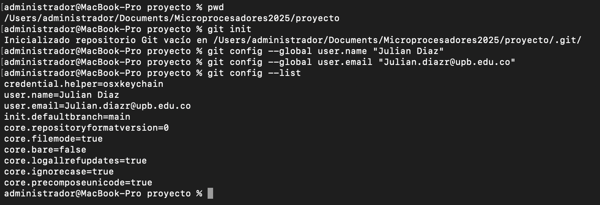
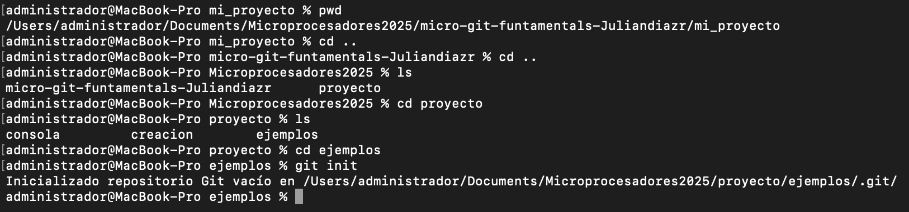
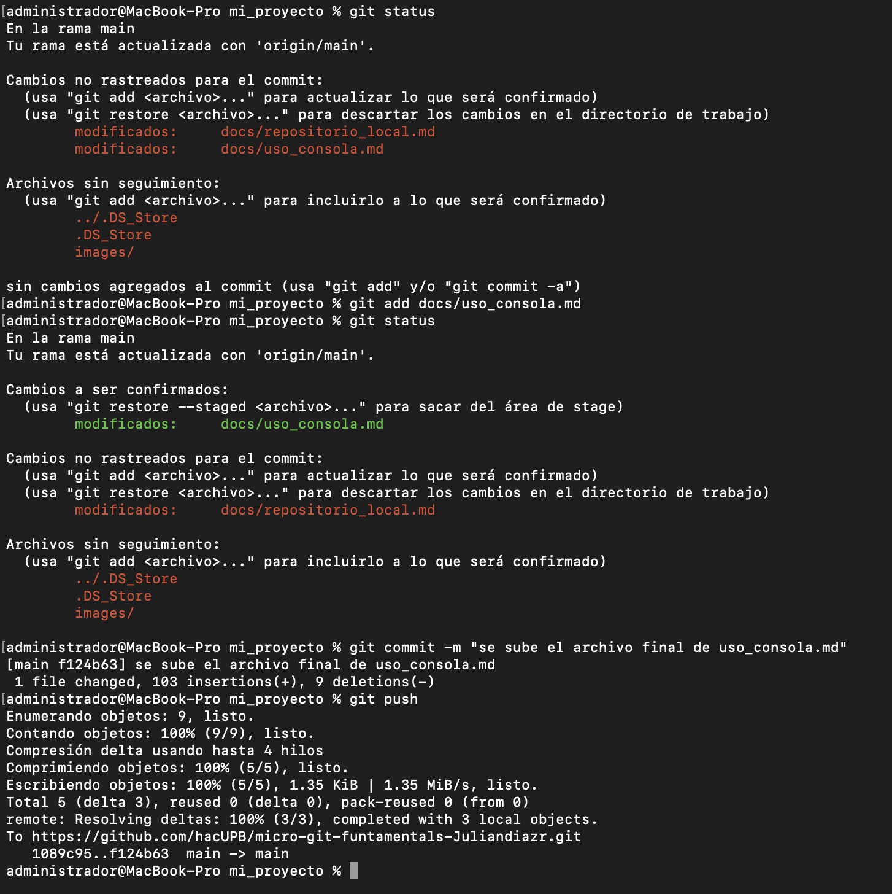

# Repositorio Local 
En este archivo lo que se va a mostrar es todo lo aprendido durante estas dos semanas
donde se hablar acerca de todos los comandos utilizados para los repositorios locales,
donde se dividirá en diferentes partes:
1. Configuración inicial
2. Creación del Repositorio
3. Estado del repositorio
4. Añadir archivos al repositorios
5. Modificar archivos en el repositorio

## 1. Configuración Inicial 
Antes de poder crear, se hará la configuración inicial, donde pondremos el nombre de usuario
y el email del usuario y despues se ejecuta el comando para verificar la configuracion que se 
hizo, los comandos que se utiliza para la configuración inicial son los siguientes:
 
 ```bash
 git config --global user.name "nombre del usuario"
 git config --global user.email "email"`
 ```



Al realizar ese comando en este caso en la aplicacion terminal se hace el siguiente comando para 
verificar que la configuración haya sido la correcta:
**git config --list**

Lo podemos ver en la siguiente imagen:


## 2. Creación del Repositorio
Para poder crear u repositorio lo que debemos hacer es primeramente crear un directorio y una vez creado se debe entrar ahí y se ejecuta el siguiente comando **git init**
como se logra obsevar en la siguiente imagen:



## 3. Estado de Repositorio 
Para ver como está el repositorio se utiliza el comando **git status** donde nos mostrará los archivos que no se han subido al repositorio local o que han tenido cambios mediante el color rojo o si estos están a punto de subirse mediante el color verde a falta de hacer el comando **git commit -m "comentario acerca del archivo"**.

## 4. Añadir archivos al repositorio
Para poder añadir archivos al repositorio, primero se tiene que ver el estado del repositorio, a partir de ahí los archivos que estén de color rojo son los que no hacen parte del repositorio, y para agregarlos usamos el comando **git add**, luego por recomendación se vuelve a hacer la verificación del estado del repositorio y debe salir el nombre del archivo en color verde, ahi utilizamos el comando **git commit -m "comentario acerca de lo que se va a subir"**, se repite la verificación de estado y si no muestra el nombre del archivo es que ya está listo para ir al repositorio, por eso ultimo se debe ejecutar el ultimo comando **git push**.

En un ejemplo juntamos tanto el estado del repositorio como el de añadir archivos al repositorio:

```
git status
git add *nombre del archivo*
git status
git commit -m "comentario"
git status
git push
```



## 5. Modificar archivos en el repositorio 
Uno de los comandos que son importantes es acerca de como podemos modificar un archivo cuando ya está en el repositorio, ya sea hacerles cambios o volver a una versión anterior.

En el caso de que se haya añadido o modificado el archivo cuando ya se haya subido al repositorio, se debe usar el comando **git status** al ejecutar nos podemos dar cuenta de que el nombre del archivo editado va a estar resaltado con color rojo, por lo que se debe de volver a subir el archivo al repositorio, mientras que si se desea modificar a la versión anterior se usa el comando **git restore "nombre del archivo"**

