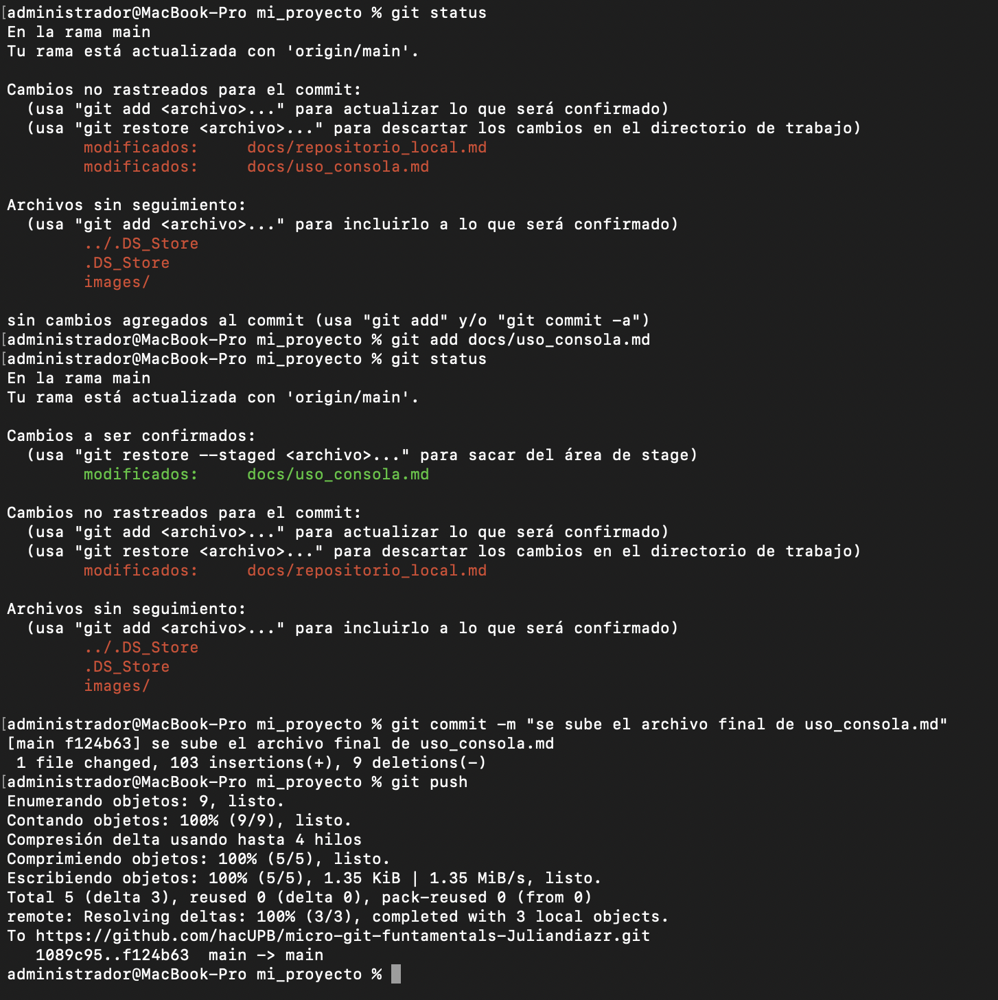

# Repositorio Remoto
A partir de lo aprendido frente al uso de la consola, según el sistema operativo, añadiendo también el uso de los repositorios remotos. Ahora vamos a aprender a usar un repositorio remoto como lo es GitHub que es una plataforma donde hace un alojamiento de codigo fuente, donde el repositorio queda en este caso en la pagina web de GitHub y a partir de esto puedes subir repositorio y archivos en linea que almacena cada uno de los preyectos y facilita a la colaboración global, a partir de esto vamos a ver los siguientes temas acerca de repositorio remoto:
 
 1. Configuración de GitHub
 2. Corregir Repositorio Remoto
 3. Clonar repositorio GitHub
 5. Subir Archivos al repositorio remoto

 ## Configuración GitHubb
 A partir ya de un repositorio local creado anteriormente y con esto debemos crear una cuenta en GitHub y descargar **GitHub cli**
  
Una vez realizado ese preoceso nos dirigimos a terminal y ejecutamos el siguiente comando con el cual nos dije sincronizar la cuenta de GitHub:

```gh auth login```

cuando tengamos esto listo lo que se hace es que crear un repositorio por la pagina de GitHub, al tener eso lo que vamos a hacer con el siguiente comando:

```git remote add origin https"enlace del repositorio"```

## Corregir Repositorio remoto
Para lograr la correción del repositorio, se ejecuta el siguiente comando:

```git remote set-url origin https://github.com/henryandr/Prog_Eval_Template_Correcto.git```

Que sirve para corregir la URL del repositorio remoto, otra de las opciones sería eliminar y volver a agregar el repositorio remoto, con el siguiente comando 

```git remote remove origin```
```git remote add origin https://github.com/henryandr/Prog_Eval_Template_Correcto.git```

y lo eliminamos con el comando 

```git remote -r```

## Clonar Repositorio
Para lograr clonar el repositorio lo que se hace es que se usa el comando

```git clone https://github.com/juanferfrancoudea/demo4.git```

## Subir Archivos 
Para subir los archivos en este caso lo que se hace como el repositorio local añadiendo un comando:

```git status
git add *nombre del archivo*
git status
git commit -m "comentario"
git status
git push
```
como se logra ver en este ejemplo:

