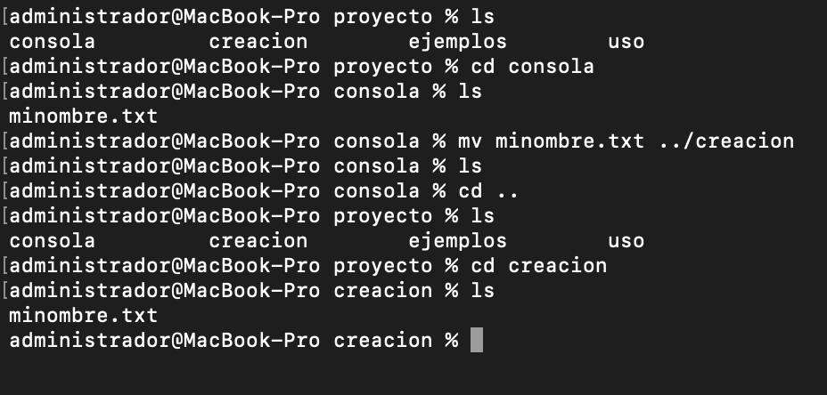

 # CONSOLA
 En este archivo se va a hacer la explicación acerca de la consola que se va a utilizar durante este semestre, donde por medio de la siguiente lista se expondrá el contenido:
 1. ¿Cúal es la consola a utilizar?
 2. Navegacion en la consola
 3. Crear directorios y archivos
 4. Mover o renombrar archivos


## ¿Cúal es la consola a utilizar?

Para este caso vamos a utilizar Git que sirve tanto para los sistemas operativos de Windows y MacOS, pero la apliación es diferente para ambos casos, primeramente para Windows se va a utilizar la aplicacion de Git Bash que se logra ver en la imagen 1.
.webp)

Mientras que para el sistema operativo MacOS se va a utilizar la aplicación de terminal y que por medio de esa app podremos ejecutar Git Hub y los repositorios que tengamos ahí, descargandolo por medio de gestor de un gestor de paquetes como Homebrew viendo el diseño de la aplicación en la imagen 2.


## Navegación de la consola
 
Durante esta parte donde explicamos como se puede navegar por la consola, en este caso usando el sistema operativo MacOS y usando la aplicación Terminal, se va a enumerar cada uno de los "comandos" de navegación aprendidos.

1. **Comando PWD**:
El uso de este comando es para lograr identificar la ubicacion del directorio actual.


```bash
 pwd
 ```

2. **Comando Ls**:
Al usar este comando lo que va a hacer es que nos muestra el contenido de un directorio o "carpeta", añadiendo que si utilizamos el comando **ls -al** lo que va a hacer es mostrar una listas de todos los archivos incluidos los ocultos 

```bash
 ls
 ls -al
 ```


3. Cambiar de Directorio 
En este caso para acceder un directorio o archivo que se desea, utilizamos el comando **cd nombre_del_directorio** y nos llevará al directorio solicitado, hay algunas "extensiones" que al ejecutarlas harán diferentes acciones de navegación.

```bash
 ls
 cd consola
 ls -al
 ```


En este ejemplo lo que se hizo fue ingresar al directorio de consola y tambbien mostrar los archivos.

 - **cd ..**: Lo que hace esta extensión es que nos va a devolver al directorio que estabamos antes del actual.

 ```bash
 PWD
 cd ..
 PWD
 ```
Con este codigo lo que hacemos es que nos muestra en que directorio estamos y con **cd ..** se sale del directorio actual


 ## Crear directorios y archivos 

 Para lograr crear un nuevo directorio nuevo lo que se va a hacer es que en el directorio actual se ejecute el comando **mkdir nombbre_del_directorio**, donde en la siguiente imagen lo que nos muestra como ejemplo es la ejecución de los comando **ls** visto anteriormente y el nuevo comando **mkdir**.

 

 Para este ejemplo se creó el archivo creación con el siguiente codigo:


Mientras que para lograr crear un archivo con cualquier extension como: .c, .md, .txt , etc... se ejecuta el comando **touch nombre_del_archivo + extensión**, como se logra obsevar mediate el siguiente codigo:

```bash
 ls
 cd cosola 
 ls -al
 touch hola.txt
 ls
 ```


En este ejemplo podemos ver la creación de un archivo llamado trabajo 1, con la extensión **.txt**.

## Mover o renombrar los archivos
Por otro lado, otros comandos importantes como el de renombrar los archivos o directorios, se utiliza el comando **mv nombre_actual nuevo_nombre** y para mover los archivos de un lugar a otro **mv nombre_origen nombre_destino**, y para borrar un archivo se ejecuta **rm nombre_del_archivo** y a continuación se mostrará en cada imagen un ejemplo de cada unos de los comandos.

- **Ejemplo de cambio de nombre**

Utilizamos el siguiente codigo:
```bash
 ls
 mv hola.txt minombre.txt
 ls
 ```


- **Ejemplo de cambiar ubicaón de archivos**

Usamos el siguiente codigo:
```bash
 ls
 cd consola 
 ls
 mv minombre.txt ../creacion
 ls
 cd ..
 ls
 cd creacion
 ```

con este comando lo que hacemos es mover el archivo **minombre.txt** del directorio consola al directorio creación.



 ## Buscar archivos o repositorios
 Utilizamos el siguiente comando:

 ```bash
 find . -name "*txt"
 ```

Lo que hace es buscar aque archivo que tenga formato **.txt** y el único archivo de ese formato es **minombre.txt**

 

 ## Eliminar archivos 

 Para eliminar archivos existen dos tipos de formatos uno es con el comando **rm "nombre del archivo"** y otra es con **rm -r "nombre del archivo"**, donde la principal diferencia es que con **rm -r** elimina es un directorio con todo su contenido, como se logra apreciar en el siguiente ejemplo

 ```bash
 ls 
 rm -r uso 
 ls
 ```

 

 Donde en este ejemplo eliminamos el directorio de **uso**, utilizando el codigo mostrado.